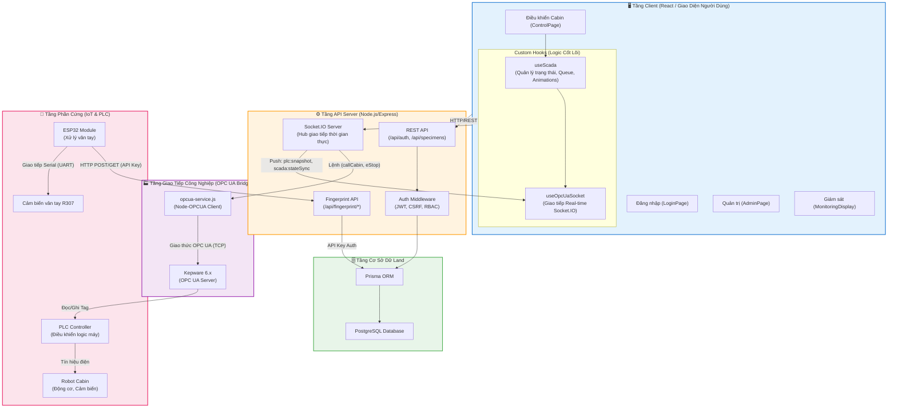
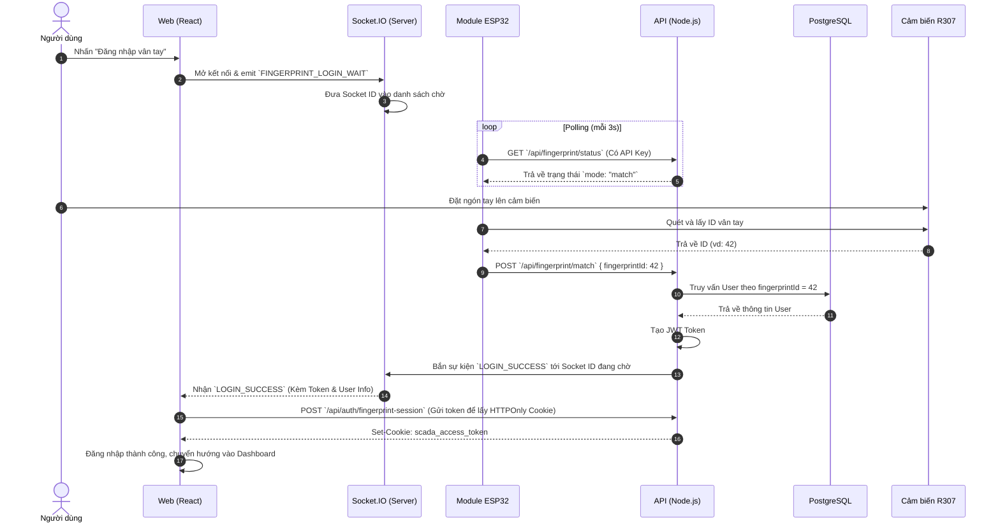
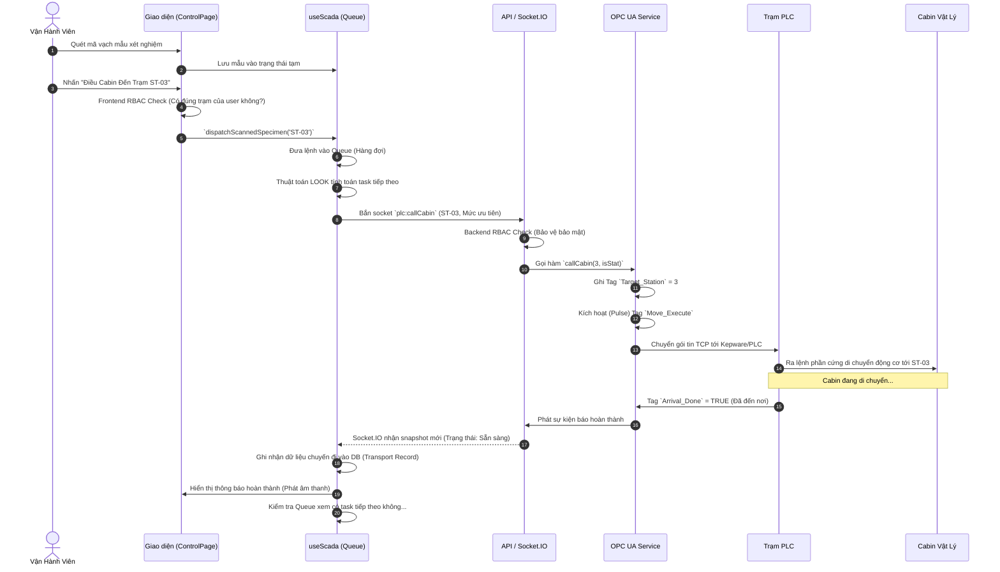

# 🏗️ Báo Cáo Kiến Trúc & Luồng Nghiệp Vụ (Workflow) - Medical SCADA

Tài liệu này cung cấp cái nhìn tổng quan và chi tiết về thiết kế kiến trúc hệ thống, các thành phần chính và luồng xử lý nghiệp vụ của dự án **Medical SCADA** (Hệ thống điều khiển và quản lý cabin vận chuyển mẫu bệnh phẩm).

---

## 1. Tổng Quan Kiến Trúc (System Architecture)

Hệ thống Medical SCADA được thiết kế theo mô hình **Full-stack + IoT Hardware**, bao gồm các lớp (layer) hoạt động độc lập và giao tiếp với nhau qua các giao thức thời gian thực (WebSockets/Socket.IO, OPC UA) và HTTP REST.

### 1.1 Sơ Đồ Kiến Trúc Tổng Thể

### 1.2 Vai Trò Các Thành Phần

1. **Client (React)**: 
   - Quản lý giao diện, cung cấp trải nghiệm thao tác mượt mà với mô phỏng cabin (SVG Animation). 
   - `useScada.js`: Central state hook, tích hợp *Queue Scheduler* dùng thuật toán thang máy (LOOK) và xử lý đồng bộ trạng thái (Hydration).
2. **API Server (Node.js)**:
   - Hub trung tâm điều phối mọi yêu cầu, thực hiện phân quyền (Role-Based Access Control - RBAC) và bảo mật (CSRF, JWT).
   - `Socket.IO`: Broadcast dữ liệu theo thời gian thực tới tất cả các trình duyệt đang mở.
3. **OPC UA Bridge**:
   - `opcua-service.js`: Chuyển đổi lệnh từ Node.js (Socket.IO) sang dạng Tag OPC UA để giao tiếp với Kepware, rồi từ Kepware đẩy xuống PLC.
4. **Phần cứng vân tay (ESP32)**:
   - Hoạt động độc lập, giao tiếp với Node.js bằng `ESP32_API_KEY`. Xử lý thao tác nhận dạng vân tay vật lý tại máy trạm.

---

## 2. Các Luồng Nghiệp Vụ Cốt Lõi (Workflows)

### 2.1 Luồng Xác Thực Vân Tay Qua Phần Cứng (ESP32 Fingerprint Login)

Đây là quy trình bảo mật không tiếp xúc (contactless), liên kết thiết bị IoT phần cứng vào luồng đăng nhập web. Thiết kế theo mô hình "Phòng chờ" (Wait Room).

### 2.2 Luồng Điều Phối Cabin (Dispatch & Queue Scheduling)

Khi điều dưỡng quét mã bệnh phẩm và yêu cầu điều cabin đến trạm của họ. Luồng này bao gồm: Xếp hàng (Queueing), Phân quyền trạm (Location-based RBAC), và Điều khiển PLC qua OPC UA.

---

## 3. Các Quyết Định Kiến Trúc Đáng Chú Ý

1. **Decoupled Hardware Authentication (Xác thực phần cứng độc lập)**:
   - ESP32 không tương tác trực tiếp với Database mà thông qua một API được bảo vệ bằng API Key. Điều này cho phép thay đổi phần cứng (ví dụ: chuyển từ ESP8266 sang ESP32 hoặc một module vân tay khác) mà không ảnh hưởng tới backend.
2. **Location-based RBAC (Kiểm soát truy cập dựa trên vị trí)**:
   - Frontend ẩn/khóa nút điều khiển nếu user không thuộc trạm đó. Tuy nhiên, Backend vẫn thẩm định lại dựa trên JWT (`stationId` trong payload), chặn triệt để mọi hành vi bypass UI qua console hay API tools.
3. **Queue Scheduler (Thuật toán Thang Máy - LOOK)**:
   - Giải quyết bài toán nhiều trạm gọi cabin cùng lúc. Hệ thống không di chuyển ngẫu nhiên hay FIFO hoàn toàn, mà ưu tiên hướng di chuyển hiện tại (giống thang máy) để tiết kiệm thời gian, trừ phi có lệnh **STAT (Khẩn cấp)** sẽ được ưu tiên tuyệt đối.
4. **State Hydration & Sync (Đồng bộ trạng thái chéo Tab/Thiết bị)**:
   - Dùng Socket.IO để push trạng thái. Khi người dùng mở thêm tab hoặc mất kết nối mạng, hệ thống tự động "hydrate" (thủy hóa) trạng thái mới nhất từ server thay vì giữ state cũ trên máy, ngăn chặn rủi ro dữ liệu sai lệch gây tai nạn vận hành.
